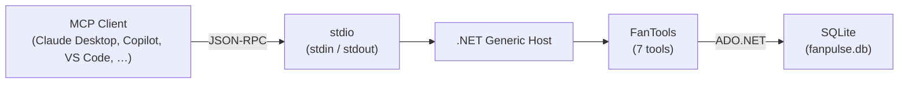
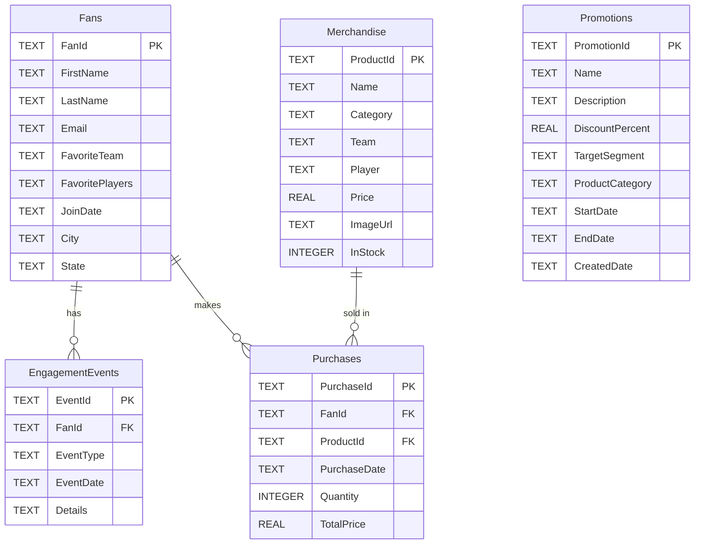

# FanPulse — C# MCP Server

A .NET 10 console application that implements a [Model Context Protocol (MCP)](https://modelcontextprotocol.io/) server over **stdio transport**. It exposes seven fan-engagement tools backed by a SQLite database — any MCP client (Claude Desktop, GitHub Copilot, VS Code, custom apps) can connect and start querying fan data, logging events, and creating promotions.



## Project Structure

```
FanPulse/
├── Program.cs                  # Entry point — DB init, host config, MCP registration
├── Tools/
│   └── FanTools.cs             # All 7 MCP tools (single class, static methods)
├── Data/
│   └── DatabaseInitializer.cs  # Schema creation + sample data seeding
├── FanPulse.csproj             # .NET 10 project file with dependencies
└── fanpulse.db                 # Auto-generated SQLite database (git-ignored)
```

| File | What it does |
|---|---|
| **`Program.cs`** | Calls `DatabaseInitializer.Initialize()` to ensure the DB exists, then builds a .NET Generic Host with `.AddMcpServer().WithStdioServerTransport().WithTools<FanTools>()`. That single chain is all it takes to wire up a working MCP server. |
| **`Tools/FanTools.cs`** | One class annotated with `[McpServerToolType]`. Each tool is a `public static` method decorated with `[McpServerTool]` and `[Description]`. Parameters use `[Description]` attributes so MCP clients can show meaningful prompts. All tools return JSON strings via `System.Text.Json`. |
| **`Data/DatabaseInitializer.cs`** | Creates 5 tables (`Fans`, `EngagementEvents`, `Merchandise`, `Purchases`, `Promotions`) and seeds them with sample data on first run. Idempotent — safe to call repeatedly. |
| **`FanPulse.csproj`** | Targets `net10.0`. References three NuGet packages (see [Dependencies](#dependencies)). |

## Tools

| Tool | Parameters | What it does |
|---|---|---|
| **GetFanProfile** | `fanIdentifier` | Looks up a fan by ID, name, or email. Returns profile, engagement history, and purchases. |
| **LogEngagementEvent** | `fanId`, `eventType`, `details`, `eventDate?` | Records an event (game attendance, app usage, social share, content view). |
| **GetFanEngagementMetrics** | `fanId?`, `days?` | Returns engagement frequency, event diversity, and scores. Omit `fanId` for all fans. |
| **SearchMerchandise** | `team?`, `category?`, `player?`, `maxPrice?`, `inStockOnly?` | Searches the merch catalog with optional filters. |
| **GetMerchRecommendations** | `fanId`, `maxResults?` | Personalized product recommendations based on the fan's team, players, and engagement level. |
| **CreatePromotion** | `name`, `description`, `discountPercent`, `targetSegment`, `productCategory`, `startDate?`, `endDate?` | Creates a targeted promo with estimated reach. |
| **GetFanSegments** | `team?` | Classifies fans into segments: superfans, engaged_no_purchase, buyers_low_engagement, casual_fans, dormant_fans. |

## Key Design Decisions

### Why .NET Generic Host?
The `Microsoft.Extensions.Hosting` host gives us dependency injection, graceful shutdown, and a lifecycle model consistent with ASP.NET Core — all in a console app. The MCP SDK plugs in as a hosted service, so startup/shutdown is handled automatically.

### Why a single `FanTools` class with static methods?
This is the pattern the C# MCP SDK expects. `[McpServerToolType]` marks the class as a tool container; `[McpServerTool]` marks each method. Static methods keep things simple — no instance state to manage. Adding a tool is just adding a method.

### Why raw ADO.NET (Microsoft.Data.Sqlite) instead of Entity Framework?
For a demo/PoC this size, EF Core adds migration overhead and abstraction layers that aren't needed. Raw SQL gives direct control, keeps the project lightweight, and makes the queries easy to read in one place.

### Why stdio transport?
Stdio is the universal MCP transport — every MCP client supports it. The server reads JSON-RPC from stdin and writes to stdout, which means any client can launch it as a child process and start talking immediately. No ports, no CORS, no firewall issues.

### Why auto-seeding the database?
Zero setup. Run `dotnet run` and the database is created and populated with realistic sample data. No scripts to run, no data imports — just build and go.

### ID conventions
| Entity | Format | Example |
|---|---|---|
| Fans | `fan-NNN` | `fan-001` |
| Products | `prod-NNN` | `prod-001` |
| Events | `evt-{guid}` | `evt-a1b2c3d4` |
| Purchases | `pur-NNN` | `pur-001` |
| Promotions | `promo-{guid}` | `promo-e5f6a7b8` |

New event and promotion IDs are generated by truncating a GUID. Seed data uses sequential numeric IDs.

## Dependencies

| Package | Version | Purpose |
|---|---|---|
| `ModelContextProtocol` | 0.8.0-preview.1 | MCP server SDK — tool registration, stdio transport, JSON-RPC |
| `Microsoft.Data.Sqlite` | 10.0.3 | SQLite data access via ADO.NET |
| `Microsoft.Extensions.Hosting` | 10.0.3 | .NET Generic Host for DI, lifecycle, and hosted services |

## Building & Running

```powershell
# Build
dotnet build FanPulse

# Run (typically launched by an MCP client, but you can run standalone)
dotnet run --project FanPulse
```

> The server communicates over stdin/stdout, so running it directly will appear to hang — it's waiting for JSON-RPC input. In practice, an MCP client (like the FanPulseDashboard in this repo) launches it as a child process.

## Database Schema



- **Fans** — Core fan profiles with team/player preferences and location.
- **EngagementEvents** — Timestamped activity log (game attendance, app usage, social shares, content views).
- **Merchandise** — Product catalog with team/player associations and stock status.
- **Purchases** — Links fans to products they've bought, with quantity and price.
- **Promotions** — Targeted discount campaigns with segment and category targeting.

## Adding a New Tool

1. Open `Tools/FanTools.cs`.
2. Add a new `public static` method to the `FanTools` class:

```csharp
[McpServerTool, Description("Brief description of what the tool does")]
public static string MyNewTool(
    [Description("What this parameter is for")] string param1,
    [Description("Optional param")] int? param2 = null)
{
    // Query the database, build a result, return JSON
    using var connection = new SqliteConnection("Data Source=fanpulse.db");
    connection.Open();
    // ... your logic here
    return JsonSerializer.Serialize(result);
}
```

3. That's it. The `WithTools<FanTools>()` call in `Program.cs` picks up all `[McpServerTool]` methods automatically — no additional registration needed.
