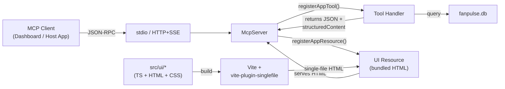
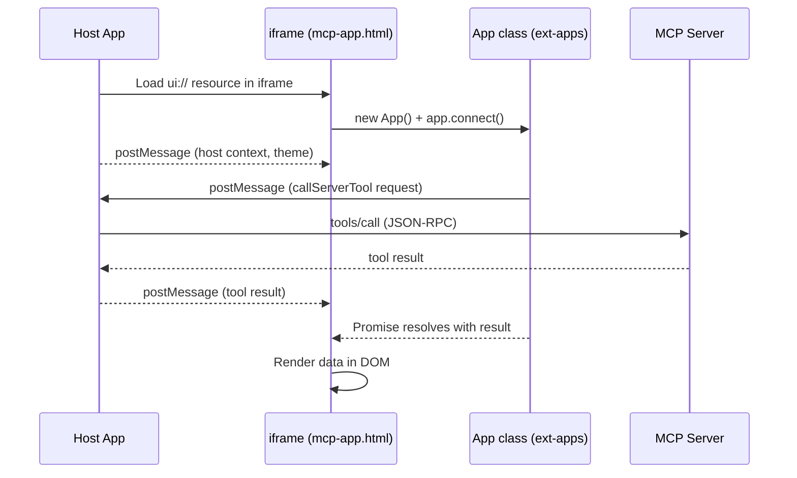

# FanPulse Apps — MCP Server with Interactive UIs

A TypeScript MCP server that extends the [Model Context Protocol](https://modelcontextprotocol.io/) with **interactive HTML user interfaces** using the [MCP Apps extension](https://www.npmjs.com/package/@modelcontextprotocol/ext-apps) (`@modelcontextprotocol/ext-apps`).

It exposes the same 7 fan-engagement tools as the [C# FanPulse server](../FanPulse/), backed by the same SQLite database — but 5 of the tools also register `ui://` resources that MCP-compatible hosts can render as rich, interactive UIs inside the chat experience.

## How It Differs from FanPulse (C#)

| | FanPulse (C#) | FanPulse Apps (TypeScript) |
|---|---|---|
| **Transport** | stdio only | stdio + HTTP/SSE |
| **Tool responses** | JSON text | JSON text + `structuredContent` for UI data |
| **UI** | None — returns plain JSON | 5 interactive HTML UIs served as `ui://` resources |
| **Registration API** | `[McpServerTool]` attribute | `registerAppTool()` / `server.tool()` |
| **Database** | Creates & seeds `fanpulse.db` | Reads the same `fanpulse.db` (run the C# server first to create it) |

Both servers can run side-by-side. The [Dashboard](../FanPulseDashboard/) connects to both simultaneously and displays their responses in side-by-side panels, making it easy to see the difference the MCP Apps extension provides.

## Architecture



## UI Communication Pattern

When a host app renders a tool's UI, the ext-apps `App` class handles all communication between the iframe and the MCP server:



The UI never talks to the server directly — the host app acts as a proxy, forwarding `callServerTool()` requests over the existing MCP transport.

## Project Structure

```
FanPulseApps/
├── main.ts                 # Entry point — stdio (--stdio flag) or HTTP/SSE (default, port 3001)
├── server.ts               # createServer() factory — instantiates McpServer, registers all 7 tools
├── src/
│   ├── types.ts            # Shared TypeScript types (Fan, Product, Segment, etc.) and constants
│   ├── data/
│   │   └── database.ts     # SQLite access via better-sqlite3; walks up dirs to find fanpulse.db
│   ├── tools/
│   │   └── fan-tools.ts    # All 7 tool implementations (registerAppTool for UIs, server.tool for JSON-only)
│   └── ui/
│       ├── global.css      # Shared CSS variables and base styles for all UIs
│       ├── fan-segments/   # Clickable segment cards with fan detail tables
│       ├── engagement-chart/  # Chart.js bar chart of engagement metrics
│       ├── merch-search/   # Product card grid with category/team/price filters
│       ├── merch-recommendations/  # Ranked recommendation cards with relevance scores
│       └── promo-builder/  # Promotion creation form with segment targeting
├── build-ui.js             # Builds each UI into a single self-contained HTML file via Vite
├── vite.config.ts          # Vite config — reads INPUT env var to build one UI at a time
├── tsconfig.json           # Type-checking config (DOM + ESNext libs for UI code, noEmit)
├── tsconfig.server.json    # Compilation config (NodeNext, outputs to dist/)
└── package.json            # Dependencies, scripts, and project metadata
```

Each UI folder contains three files:

| File | Purpose |
|---|---|
| `mcp-app.html` | HTML shell with a `<script type="module">` pointing to the TS entry |
| `mcp-app.ts` | UI logic — creates an `App` instance, calls `app.callServerTool()`, renders results |
| `styles.css` | Component-scoped styles |

## The 7 Tools

| Tool | Has UI | Description |
|---|---|---|
| `GetFanSegments` | ✅ Fan Segments Explorer | Segments fans by engagement + purchase behavior |
| `GetFanEngagementMetrics` | ✅ Engagement Chart | Chart.js bar chart of engagement scores |
| `SearchMerchandise` | ✅ Merchandise Search | Filterable product card grid |
| `GetMerchRecommendations` | ✅ Recommendation Cards | Personalized merch recommendations |
| `CreatePromotion` | ✅ Promotion Builder | Form to create targeted promotions |
| `GetFanProfile` | ❌ | Returns fan profile as JSON |
| `LogEngagementEvent` | ❌ | Records an engagement event, returns confirmation JSON |

Tools **with** a UI use `registerAppTool()` + `registerAppResource()` from `@modelcontextprotocol/ext-apps/server`. Tools **without** a UI use the standard `server.tool()` from `@modelcontextprotocol/sdk`.

## Key Design Decisions

### Why TypeScript?

The MCP Apps extension (`@modelcontextprotocol/ext-apps`) is TypeScript-first. There is no C# SDK for ext-apps yet. The `registerAppTool`, `registerAppResource`, and client-side `App` class are all provided as TypeScript packages.

### Why vanilla TypeScript for UIs (no React)?

The ext-apps SDK examples use vanilla TypeScript with the `App` class. Each UI is intentionally minimal — it creates an `App` instance, calls `app.callServerTool()` to fetch data, and renders directly to the DOM. This keeps the dependency footprint small and the bundled HTML files lightweight.

### Why Vite + vite-plugin-singlefile?

MCP App UIs must be **self-contained single HTML files**. The server reads each built HTML file from disk and serves it as the content of a `ui://` resource with MIME type `text/html+mcp`. `vite-plugin-singlefile` inlines all CSS and JS into a single HTML file — no external assets, no CDN references.

### Why two transport modes?

- **stdio** (`--stdio`): Used when an MCP client (like the FanPulseDashboard) launches this server as a child process. One server instance serves one client.
- **HTTP/SSE** (default): Used for browser-based or remote clients. Each request to `/mcp` creates a fresh `McpServer` instance with its own `StreamableHTTPServerTransport`.

### Why a shared database?

Both the C# and TypeScript servers access the same `fanpulse.db`. This demonstrates that multiple MCP servers can provide different views (JSON vs. interactive UI) of the same underlying data. The C# server creates and seeds the database on first run; the TypeScript server expects it to already exist.

### `registerAppTool` vs `server.tool`

`registerAppTool` wraps `server.tool` but adds `_meta.ui.resourceUri` to the tool's metadata. This tells the host app: "this tool has an associated UI — fetch it from this `ui://` URI and render it." The tool handler returns both:
- `content` — standard MCP text content (JSON), used by any MCP client
- `structuredContent` — typed data object, used by the UI to render rich views

`registerAppResource` registers the `ui://` URI as an MCP resource. When the host reads it, the server loads the built HTML file from `dist/` and returns it with MIME type `text/html+mcp`.

### UI ↔ Server communication

UIs don't communicate with the server directly. Instead:

1. The UI creates an `App` instance and calls `app.connect()` to establish a `postMessage` bridge with the host.
2. To fetch data, the UI calls `app.callServerTool({ name: "ToolName", arguments: {...} })`.
3. The `App` class sends a `postMessage` to the host, which forwards it as a `tools/call` JSON-RPC request to the MCP server.
4. The result flows back through the same channel and the `App` class resolves the promise.

This means UIs can call **any** tool on the server, not just the one they're associated with.

## Dependencies

| Package | Version | Purpose |
|---|---|---|
| `@modelcontextprotocol/sdk` | ^1.24.0 | MCP server SDK (McpServer, transports) |
| `@modelcontextprotocol/ext-apps` | ^1.0.0 | MCP Apps extension (registerAppTool, registerAppResource, App class) |
| `better-sqlite3` | ^11.8.1 | SQLite database access |
| `express` | ^5.1.0 | HTTP server for StreamableHTTPServerTransport |
| `cors` | ^2.8.5 | CORS middleware for HTTP transport |
| `chart.js` | ^4.4.0 | Bar charts in the engagement metrics UI |
| `zod` | ^4.1.13 | Input schema validation for tool parameters |

**Dev dependencies:**

| Package | Version | Purpose |
|---|---|---|
| `typescript` | ^5.9.3 | TypeScript compiler |
| `vite` | ^6.0.0 | Build tool for UI bundling |
| `vite-plugin-singlefile` | ^2.3.0 | Inlines all assets into a single HTML file |
| `concurrently` | ^9.2.1 | Run UI watch + server watch in parallel (dev mode) |
| `cross-env` | ^10.1.0 | Cross-platform env vars for build-ui.js |

## Building & Running

### Prerequisites

- Node.js 18+
- The C# FanPulse server must have been run at least once to create and seed `fanpulse.db`

### Build

```bash
npm install
npm run build
```

This runs three steps:
1. `tsc --noEmit` — Type-checks all source (UI + server)
2. `node build-ui.js` — Builds each UI into a self-contained HTML file in `dist/`
3. `tsc -p tsconfig.server.json` — Compiles server code to `dist/`

### Run (HTTP/SSE mode)

```bash
npm start
# Server listens on http://localhost:3001/mcp
```

### Run (stdio mode)

```bash
npm run start:stdio
# Or directly:
node dist/main.js --stdio
```

### Dev mode

```bash
npm run dev
# Watches UI files for changes and restarts the server
```

## Adding a New Tool with UI

### 1. Create the UI folder

```
src/ui/my-new-tool/
├── mcp-app.html
├── mcp-app.ts
└── styles.css
```

**`mcp-app.html`** — minimal HTML shell:

```html
<!DOCTYPE html>
<html lang="en">
<head>
  <meta charset="UTF-8">
  <meta name="viewport" content="width=device-width, initial-scale=1.0">
  <meta name="color-scheme" content="light dark">
  <title>My New Tool</title>
</head>
<body>
  <main id="app"></main>
  <script type="module" src="./mcp-app.ts"></script>
</body>
</html>
```

**`mcp-app.ts`** — UI logic using the `App` class:

```typescript
import { App, applyDocumentTheme, applyHostStyleVariables, applyHostFonts, type McpUiHostContext } from "@modelcontextprotocol/ext-apps";
import "../global.css";
import "./styles.css";

const app = new App({ name: "My New Tool", version: "1.0.0" });

function handleHostContext(ctx: McpUiHostContext) {
  if (ctx.theme) applyDocumentTheme(ctx.theme);
  if (ctx.styles?.variables) applyHostStyleVariables(ctx.styles.variables);
  if (ctx.styles?.css?.fonts) applyHostFonts(ctx.styles.css.fonts);
}

app.onhostcontextchanged = handleHostContext;
applyDocumentTheme(window.matchMedia("(prefers-color-scheme: dark)").matches ? "dark" : "light");

app.connect().then(() => {
  const ctx = app.getHostContext();
  if (ctx) handleHostContext(ctx);
});

// Fetch data from the server
async function fetchData() {
  const result = await app.callServerTool({ name: "MyNewTool", arguments: {} });
  const text = result.content!
    .filter((c): c is { type: "text"; text: string } => c.type === "text")
    .map((c) => c.text)
    .join("");
  const data = JSON.parse(text);
  // Render data...
}

setTimeout(fetchData, 100);
```

### 2. Add to `build-ui.js`

Add the new HTML entry to the `UIS` array:

```javascript
const UIS = [
  // ...existing entries...
  "src/ui/my-new-tool/mcp-app.html",
];
```

### 3. Register the tool in `fan-tools.ts`

```typescript
export function registerMyNewTool(server: McpServer) {
  const resourceUri = "ui://fanpulse/my-new-tool.html";

  registerAppTool(
    server,
    "MyNewTool",
    {
      title: "My New Tool",
      description: "Description of what this tool does.",
      inputSchema: MyNewToolInput.shape,
      _meta: { ui: { resourceUri } },
    },
    async (args): Promise<CallToolResult> => {
      const data = /* query database */;
      return {
        content: [{ type: "text", text: JSON.stringify(data, null, 2) }],
        structuredContent: data,
      };
    }
  );

  registerAppResource(
    server,
    resourceUri,
    resourceUri,
    { mimeType: RESOURCE_MIME_TYPE, description: "My New Tool UI" },
    async (): Promise<ReadResourceResult> => ({
      contents: [{ uri: resourceUri, mimeType: RESOURCE_MIME_TYPE, text: await loadUiHtml("src/ui/my-new-tool/mcp-app.html") }],
    })
  );
}
```

### 4. Wire it up in `server.ts`

```typescript
import { registerMyNewTool } from "./src/tools/fan-tools.js";

export function createServer(): McpServer {
  const server = new McpServer({ name: "FanPulse Apps Server", version: "1.0.0" });
  // ...existing registrations...
  registerMyNewTool(server);
  return server;
}
```

### 5. Build and test

```bash
npm run build
npm start
```
