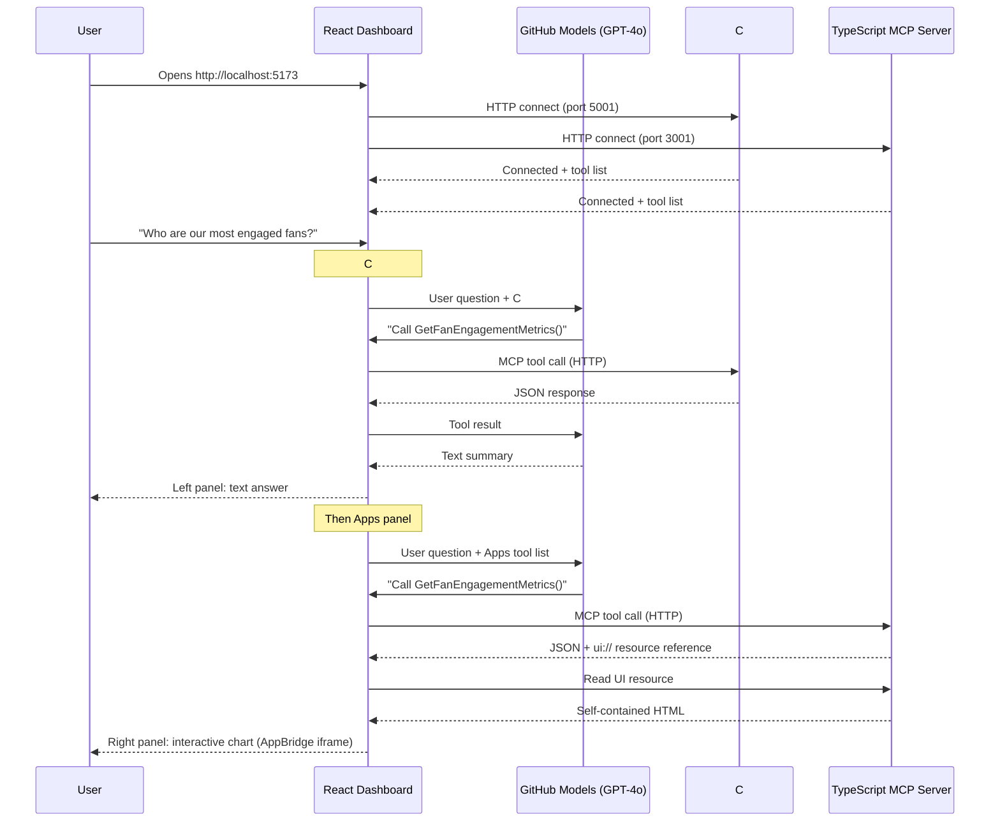

# FanPulse Architecture — How It All Fits Together

This document explains the architecture of the FanPulse platform — a fan engagement
intelligence system built on the **Model Context Protocol (MCP)**.

---

## The Big Picture

FanPulse is made up of three components that work together:

```mermaid
graph LR
    subgraph "👤 User"
        U[User asks a question]
    end

    subgraph "🖥️ FanPulse Dashboard"
        D[AI Chat Console]
        LLM[GitHub Models GPT-4o]
    end

    subgraph "🔧 MCP Servers"
        S1["FanPulse<br/>(C# · text/JSON)"]
        S2["FanPulse Apps<br/>(TypeScript · interactive UIs)"]
    end

    subgraph "💾 Data"
        DB[(fanpulse.db<br/>SQLite)]
    end

    U -->|types question| D
    D -->|sends to| LLM
    LLM -->|calls tools via MCP| S1
    LLM -->|calls tools via MCP| S2
    S1 -->|queries| DB
    S2 -->|queries| DB
    D -->|shows answer| U

    style S1 fill:#4f46e5,color:#fff
    style S2 fill:#059669,color:#fff
    style DB fill:#f59e0b,color:#000
    style LLM fill:#6366f1,color:#fff
```

The Dashboard connects to **both** servers simultaneously over HTTP and shows their responses side-by-side — text on the left, interactive UIs on the right.

---

## What Is MCP?

The **Model Context Protocol** is an open standard that lets AI assistants securely connect
to external tools and data sources. Think of it as a universal plugin system for AI:

Any MCP client (Claude Desktop, GitHub Copilot, ChatGPT, or our Dashboard) can connect
to any MCP server. The protocol handles all the communication details.

---

## Two Servers, Two Experiences

The key insight of this project is that the **same tools** can deliver very different
user experiences depending on the server implementation:

### FanPulse (C# Server)
- Tools return **JSON strings**
- The AI model reads the JSON and writes a **natural language summary**
- Works with every MCP client — no special support needed

### FanPulse Apps (TypeScript Server)
- Tools return **JSON + a `ui://` resource**
- MCP clients that support ext-apps render the resource as an **interactive iframe**
- Users can click, filter, sort, and explore data directly
- Falls back gracefully to JSON for clients that don't support ext-apps

---

## The Dashboard Flow

When a user runs the Dashboard, here's what happens step by step:

---

## Data Model

All three components share a single SQLite database with this schema:

The database comes pre-seeded with 12 fans, 44 engagement events, 25 merchandise products,
and 8 purchase records across three fictional teams (Thunderbolts, River Wolves, Summit FC).

---

## Fan Segmentation Logic

One of the most powerful features is automatic fan segmentation. The system classifies
fans into groups based on their behavior:

```mermaid
flowchart TD
    START[Fan Data] --> CHECK_ENG{Engagements ≥ 4?}

    CHECK_ENG -->|Yes| CHECK_PURCH1{Has purchases?}
    CHECK_PURCH1 -->|Yes| SUPER["⭐ Superfan<br/>High engagement + buyer"]
    CHECK_PURCH1 -->|No| CHECK_ENG3{Engagements ≥ 3?}

    CHECK_ENG -->|No| CHECK_PURCH2{Has purchases?}
    CHECK_PURCH2 -->|Yes| BUYER["🛒 Buyer, Low Engagement<br/>Purchased but not active"]
    CHECK_PURCH2 -->|No| CHECK_ANY{Any engagement?}

    CHECK_ENG3 -->|Yes| ENGAGED["🎯 Engaged, No Purchase<br/>Active but hasn't bought"]
    CHECK_ENG3 -->|No| CHECK_PURCH2

    CHECK_ANY -->|Yes, 1-2| CASUAL["👋 Casual Fan<br/>Some activity"]
    CHECK_ANY -->|No| DORMANT["💤 Dormant Fan<br/>At risk of churn"]

    style SUPER fill:#059669,color:#fff
    style ENGAGED fill:#6366f1,color:#fff
    style BUYER fill:#f59e0b,color:#000
    style CASUAL fill:#0d9488,color:#fff
    style DORMANT fill:#ef4444,color:#fff
```

---

## How MCP Apps Work (ext-apps)

The TypeScript server uses the MCP Apps extension to serve interactive UIs.
Here's how a tool with a UI works end-to-end:

Each UI is bundled into a **single self-contained HTML file** (all CSS and JavaScript
inlined) using Vite's single-file plugin. This means no external dependencies at
render time — the HTML string is everything the client needs.

---

## Technology Stack

```mermaid
graph TB
    subgraph "FanPulse — C# Server"
        NET[".NET 10"]
        SQLITE_CS["Microsoft.Data.Sqlite"]
        MCP_CS["ModelContextProtocol SDK"]
        MCP_ASP["ModelContextProtocol.AspNetCore"]
        STDIO1["stdio transport"]
        HTTP1["HTTP transport (:5001)"]
    end

    subgraph "FanPulse Apps — TypeScript Server"
        NODE["Node.js"]
        SQLITE_TS["better-sqlite3"]
        MCP_TS["@modelcontextprotocol/sdk"]
        EXTAPPS["@modelcontextprotocol/ext-apps"]
        CHARTJS["Chart.js"]
        VITE["Vite + singlefile plugin"]
        STDIO2["stdio transport"]
        HTTP2["HTTP transport (:3001)"]
    end

    subgraph "FanPulse Dashboard — React App"
        REACT["React + TypeScript"]
        MCP_CLIENT["@modelcontextprotocol/sdk Client"]
        APPBRIDGE["@modelcontextprotocol/ext-apps AppBridge"]
        VITE2["Vite dev server"]
        OPENAI["GitHub Models · GPT-4o"]
    end

    subgraph "Shared Data"
        DB[(fanpulse.db)]
    end

    SQLITE_CS --> DB
    SQLITE_TS --> DB

    style NET fill:#512bd4,color:#fff
    style REACT fill:#61dafb,color:#000
    style NODE fill:#339933,color:#fff
    style DB fill:#f59e0b,color:#000
```

---

## Summary

| Component | Language | Transport | Returns | When to Use |
|---|---|---|---|---|
| **FanPulse** | C# / .NET | stdio + HTTP | JSON text | Universal MCP client compatibility |
| **FanPulse Apps** | TypeScript | stdio + HTTP | JSON + interactive UIs | Rich visual experiences in VS Code, Claude, or Dashboard |
| **Dashboard** | React / TypeScript | HTTP (client) | AI chat + AppBridge UIs | Side-by-side comparison of text vs interactive UX |

The architecture is designed so that:
- Both servers are **interchangeable** — same tools, same data, different UX
- The Dashboard lets you **compare side-by-side** which experience works better
- Each component can be used **independently** or together
