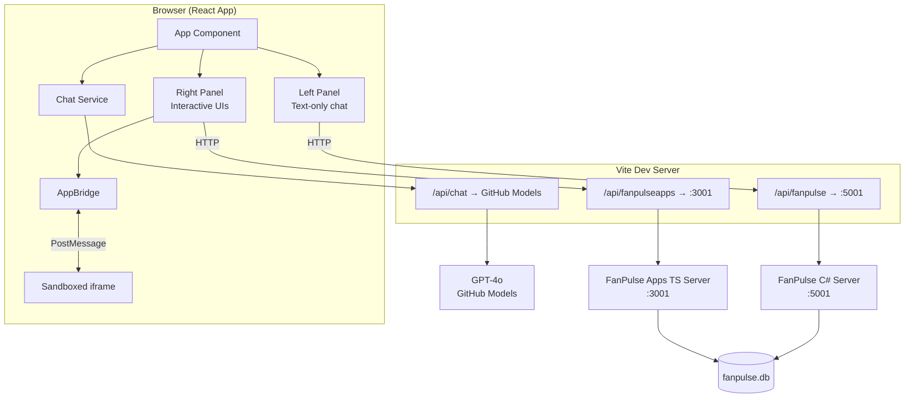

# FanPulse Dashboard — React MCP Apps Host

A React web application that connects to **both** FanPulse MCP servers and displays their responses side-by-side — text-only on the left, interactive ext-apps UIs on the right.

Unlike simple MCP clients, this dashboard is a proper **MCP Apps host**: it uses `AppBridge` from the ext-apps SDK to render interactive UIs inside sandboxed iframes, enabling full bidirectional communication between the UIs and the MCP servers.

## Architecture



## How It Works

1. The React app connects to both MCP servers via HTTP using `StreamableHTTPClientTransport`
2. User enters a prompt — it's sent to **GPT-4o** twice (once per server, sequentially to avoid rate limits)
3. GPT-4o decides which MCP tools to call, and the dashboard executes them
4. **Left panel**: The C# server returns JSON data → GPT-4o summarizes as text
5. **Right panel**: The Apps server returns the same data, plus the tool definition includes a `ui://` resource URI
   - The dashboard fetches the HTML from that URI
   - Creates an `AppBridge` with the MCP client and host capabilities (`serverTools`, `serverResources`)
   - Injects the HTML into a sandboxed iframe via `document.write()` after the bridge transport starts listening
   - The bridge auto-proxies tool calls from the UI back to the MCP server
   - The UI renders interactively — charts, cards, forms with real server communication

## Build & Run

### Prerequisites

- [Node.js](https://nodejs.org/) ≥ 18
- Both MCP servers built and running in HTTP mode (see root README)
- A `GITHUB_TOKEN` environment variable with [GitHub Models](https://github.com/marketplace/models) access

### Start the servers

```powershell
# Terminal 1: C# MCP server (HTTP mode on port 5001)
dotnet run --project FanPulse -- --http

# Terminal 2: TypeScript MCP server (HTTP mode on port 3001)
cd FanPulseApps && npm start
```

### Start the Dashboard

```powershell
# Terminal 3
cd FanPulseDashboard
npm install
$env:GITHUB_TOKEN = "ghp_..."
npm run dev
```

Open **http://localhost:5173** and ask questions like:
- *"Show me the fan segments"*
- *"What merchandise do we have for the Thunderbolts?"*
- *"Create a 20% promotion for superfans"*

## Project Structure

```
FanPulseDashboard/
├── src/
│   ├── main.tsx              # Entry point
│   ├── styles.css            # Dark theme CSS
│   ├── types.ts              # Shared types and server config
│   ├── components/
│   │   ├── App.tsx           # Main layout + chat orchestration
│   │   ├── ChatPanel.tsx     # Reusable chat panel component
│   │   └── AppFrame.tsx      # ext-apps iframe + AppBridge lifecycle
│   └── hooks/
│       ├── useMcpClient.ts   # React hook for MCP server connections
│       └── chatService.ts    # LLM function-calling loop
├── vite.config.ts            # Vite config with proxy + LLM middleware
├── index.html                # HTML shell
└── package.json              # Dependencies
```

## Key Design Decisions

| Decision | Choice | Rationale |
|---|---|---|
| Framework | React + TypeScript | `AppBridge` is browser-side JavaScript — React uses it directly with no proxy layer |
| Transport | HTTP (both servers) | Browser can connect directly; no child process spawning needed |
| LLM proxy | Vite dev server plugin | Keeps `GITHUB_TOKEN` server-side |
| Styling | Dark theme, CSS custom properties | Matches VS Code dark mode; ext-apps UIs inherit theme via AppBridge |
| Sandboxing | `srcdoc` + `sandbox` attribute | Simplified approach suitable for demo; production would use double-iframe pattern |

## AppBridge Integration

The `AppFrame` component manages the ext-apps lifecycle:

1. **Create `AppBridge`** with the MCP client, host capabilities (`serverTools`, `serverResources`), and initial host context (dark theme, CSS custom properties via `--`-prefixed variable names, container dimensions)
2. **Create `PostMessageTransport`** targeting the iframe's `contentWindow`
3. **Connect bridge** — `bridge.connect(transport)` auto-wires `oncalltool` to proxy tool calls from the UI back to the server
4. **Inject HTML** via `document.write()` — the bridge transport is already listening when the app's `connect()` fires
5. **Send tool input and result** — the UI uses these to render its initial state
6. **Handle resize** — the UI reports its preferred size via the bridge

The iframe sandbox includes `allow-scripts allow-same-origin allow-forms` to enable JavaScript execution, same-origin PostMessage routing, and form interactions within the UI.

This is the same pattern used by VS Code and other MCP Apps hosts.

## Dependencies

| Package | Purpose |
|---|---|
| `@modelcontextprotocol/sdk` | MCP client, `StreamableHTTPClientTransport` |
| `@modelcontextprotocol/ext-apps` | `AppBridge`, `PostMessageTransport`, `getToolUiResourceUri` |
| `openai` | OpenAI-compatible chat types |
| `react`, `react-dom` | UI framework |
| `vite`, `@vitejs/plugin-react` | Build tool and dev server |
