# FanPulse Dashboard

A **Blazor Server** web application that connects to two MCP servers simultaneously and displays their responses **side-by-side**. The left panel shows text-only responses from the C# FanPulse server; the right panel shows the same data rendered as interactive HTML visualizations from the TypeScript FanPulse Apps server.

The goal is to demonstrate the value of the [MCP Apps extension](https://github.com/modelcontextprotocol/ext-apps) — by putting plain-text and rich-UI responses next to each other, the difference is immediately visible.

## Architecture

```mermaid
graph LR
    Browser["🌐 Browser"]
    SignalR["SignalR WebSocket"]
    Blazor["Blazor Server<br/>(ChatService)"]
    LLM["GPT-4o<br/>(GitHub Models)"]
    CS["FanPulse C# Server<br/>(stdio)"]
    TS["FanPulse Apps TS Server<br/>(stdio)"]
    DB[("fanpulse.db<br/>SQLite")]

    Browser <-->|"Real-time UI updates"| SignalR
    SignalR <--> Blazor
    Blazor -->|"Chat completions +<br/>function calling"| LLM
    Blazor <-->|"StdioClientTransport"| CS
    Blazor <-->|"StdioClientTransport"| TS
    CS --> DB
    TS --> DB
```



The Dashboard acts as an **MCP client**. On startup it launches both MCP servers as child processes, connects via `StdioClientTransport`, discovers their tools, and proxies user prompts through GPT-4o with automatic function invocation. Each prompt is sent to the LLM twice — once with C# server tools, once with TypeScript server tools — and the responses are rendered in parallel panels.

## Project Structure

```
FanPulseDashboard/
├── Program.cs                          # Blazor Server host setup
├── Services/
│   └── ChatService.cs                  # Core service: MCP clients, LLM, visualizations
├── Components/
│   ├── App.razor                       # Root HTML document (ImportMap, HeadOutlet, Routes)
│   ├── Routes.razor                    # Blazor router with MainLayout
│   ├── _Imports.razor                  # Shared @using directives
│   ├── Layout/
│   │   └── MainLayout.razor            # App shell with header
│   └── Pages/
│       └── Home.razor                  # Main page: side-by-side chat panels
├── wwwroot/
│   └── css/
│       └── app.css                     # Dark-themed UI (CSS custom properties, grid, animations)
├── Properties/
│   └── launchSettings.json             # Dev profile: http://localhost:5000
├── FanPulseDashboard.csproj            # .NET 10, Microsoft.NET.Sdk.Web
└── doc/
    └── FanPulseDashboard-Overview.md   # Additional documentation
```

### File-by-File

| File | Purpose |
|---|---|
| **`Program.cs`** | Configures the Blazor Server host. Registers `AddRazorComponents` + `AddInteractiveServerComponents`, adds `ChatService` as a singleton, maps `UseAntiforgery`, `MapStaticAssets`, and `MapRazorComponents<App>` with `AddInteractiveServerRenderMode`. |
| **`Services/ChatService.cs`** | The heart of the app. Manages two `McpClient` instances (C# and TypeScript servers via `StdioClientTransport`), a shared `IChatClient` (GPT-4o), two separate conversation histories, streaming responses with `UseFunctionInvocation`, and five server-side HTML visualization builders. Implements `IAsyncDisposable` to clean up child processes. |
| **`Components/App.razor`** | Root HTML document. Uses `@Assets["css/app.css"]` and `@Assets["_framework/blazor.web.js"]` for fingerprinted static assets. Includes `<ImportMap />` and `<HeadOutlet />`. |
| **`Components/Routes.razor`** | Standard Blazor router referencing `MainLayout` as the default layout. |
| **`Components/_Imports.razor`** | Shared `@using` directives including `@using static Microsoft.AspNetCore.Components.Web.RenderMode` (enables `@rendermode InteractiveServer` shorthand). |
| **`Components/Layout/MainLayout.razor`** | App shell: header ("🏟️ FanPulse Dashboard — Side-by-Side MCP Server Comparison") and `@Body` content area. |
| **`Components/Pages/Home.razor`** | The main UI. Uses `@rendermode InteractiveServer`. Injects `ChatService`, shows a connection spinner on startup, then renders an input bar and two chat panels. The left panel (C# server) shows text messages. The right panel (Apps server) shows text messages plus `<iframe srcdoc="...">` for rich visualizations. |
| **`wwwroot/css/app.css`** | Dark theme with CSS custom properties (`--bg: #0f172a`, `--accent-csharp: #8b5cf6`, `--accent-apps: #10b981`). Styles for the grid layout, chat messages, panels, spinners, and iframe containers. |
| **`Properties/launchSettings.json`** | Development profile: runs on `http://localhost:5000` with `ASPNETCORE_ENVIRONMENT=Development`. |

## Key Design Decisions

### Why Blazor Server (not Blazor WebAssembly)?

The Dashboard launches MCP servers as **child processes** using `StdioClientTransport`, which spawns `dotnet run` and `node` subprocesses and communicates over their stdin/stdout. This can only happen server-side — a browser sandbox cannot spawn processes. Blazor Server runs all C# logic on the server and pushes UI updates to the browser over **SignalR**, which also gives us real-time streaming of chat responses without polling.

### Why is ChatService a singleton?

`ChatService` manages two long-lived child processes (the MCP servers) and a shared LLM client. These resources are expensive to create and must outlive any single Blazor circuit (browser tab). A singleton ensures:
- Servers are started once and reused across all connections
- Conversation state persists if the user refreshes the page
- Clean shutdown via `IAsyncDisposable` when the app stops

### Why sequential LLM calls instead of parallel?

Both the C# and Apps panels hit the same GitHub Models API (GPT-4o). Sending two streaming requests in parallel consistently triggers **HTTP 429 (Too Many Requests)** rate limits. The code sends them sequentially:

```csharp
// Send to both servers sequentially to avoid GitHub Models rate limits
var csharpResponse = await GetResponseAsync(_csharpMessages, csharpTools);
var appsResponse = await GetResponseWithUiAsync(_appsMessages, appsTools);
```

### Why `iframe srcdoc` for visualizations?

The right panel renders visualizations inside `<iframe srcdoc="...">`:
- **Self-contained**: Each visualization is a complete HTML document with inline CSS/JS — no external dependencies
- **Sandboxed**: The `sandbox="allow-scripts allow-same-origin"` attribute isolates visualization code from the parent Blazor app
- **No CORS issues**: `srcdoc` renders inline HTML, avoiding cross-origin fetch problems
- **Simple integration**: Blazor just sets a string property; no JavaScript interop needed

### Why server-generated visualizations instead of using ext-apps UIs directly?

The TypeScript FanPulse Apps server includes interactive HTML UIs built with `@modelcontextprotocol/ext-apps`. Those UIs call `app.callServerTool()` via `postMessage`, which requires an **MCP Apps host bridge** — a runtime that mediates between the UI iframe and the MCP server.

Our Dashboard iframe has no such bridge. Instead, `ChatService` extracts the raw JSON tool results and generates **data-driven HTML server-side** using five `Build*Html` methods. These produce self-contained visualizations with the same data, styled with Dracula-inspired dark theme CSS and animations.

### Why `@rendermode InteractiveServer` per-page?

`Home.razor` declares `@rendermode InteractiveServer` at the page level rather than setting it globally in `App.razor`. This follows **.NET 10 Blazor conventions**:
- The initial page load is server-side rendered (SSR) for fast first paint
- Interactive mode activates after SignalR connects
- Other pages (if added later) can choose their own render mode

### Why `MapStaticAssets`?

`.NET 10` introduced `MapStaticAssets()` as a replacement for `UseStaticFiles()`. It serves `_framework/blazor.web.js` and static files from `wwwroot/` with **content-based fingerprinting** via the `@Assets[...]` directive in Razor, enabling aggressive browser caching.

### Why streaming with `UseFunctionInvocation`?

The `IChatClient` is built with `.UseFunctionInvocation()`:

```csharp
_chatClient = openAIClient
    .GetChatClient("gpt-4o")
    .AsIChatClient()
    .AsBuilder()
    .UseFunctionInvocation()
    .Build();
```

This middleware **automatically invokes MCP tools** when the LLM emits function calls. Without it, you'd need manual dispatch code to match function names, deserialize arguments, call tools, and feed results back. The middleware handles the full tool-calling loop transparently.

## Dependencies

| Package | Version | Purpose |
|---|---|---|
| `Microsoft.Extensions.AI` | 10.3.0 | `IChatClient` abstraction, `ChatMessage`, streaming APIs |
| `Microsoft.Extensions.AI.OpenAI` | 10.3.0 | OpenAI/GitHub Models integration for `IChatClient` |
| `ModelContextProtocol` | 0.8.0-preview.1 | MCP client SDK — `McpClient`, `StdioClientTransport`, `McpClientTool` |

**Implicit SDK dependencies** (from `Microsoft.NET.Sdk.Web`): ASP.NET Core, Blazor Server, SignalR, Razor Components.

## Building & Running

### Prerequisites

- [.NET 10 SDK](https://dotnet.microsoft.com/download/dotnet/10.0)
- [Node.js](https://nodejs.org/) (≥ 18, for the TypeScript MCP server)
- A **GitHub PAT** with access to [GitHub Models](https://github.com/marketplace/models)

### Build

Both MCP servers must be built before the Dashboard can launch them as child processes:

```powershell
# From the repo root (MCPTest/)

# 1. Build the C# MCP server
dotnet build FanPulse

# 2. Build the TypeScript MCP server
cd FanPulseApps && npm install && npm run build && cd ..

# 3. Build the Dashboard
dotnet build FanPulseDashboard
```

### Run

```powershell
# Set the GitHub Models API token
$env:GITHUB_TOKEN = "ghp_..."

# Start the Dashboard (launches both MCP servers automatically)
dotnet run --project FanPulseDashboard
```

Open **http://localhost:5000** in your browser. The Dashboard will:
1. Spawn the C# FanPulse server (`dotnet run --no-build --project ../FanPulse`)
2. Spawn the TypeScript FanPulse Apps server (`node ../FanPulseApps/dist/main.js --stdio`)
3. Connect to both via MCP, discover tools, and show the chat UI

### Troubleshooting

| Symptom | Cause | Fix |
|---|---|---|
| "GITHUB_TOKEN environment variable is not set" | Missing API token | Set `$env:GITHUB_TOKEN` before running |
| "Failed to initialize" on startup | MCP server build missing | Run `dotnet build FanPulse` and `npm run build` in `FanPulseApps/` |
| 429 errors in logs | GitHub Models rate limit | Wait and retry; the sequential call pattern minimizes this |
| Visualization not appearing | Tool result format mismatch | Check logs for `ExtractJsonContent` debug output |
| Blank right panel iframe | HTML generation error | Check logs for `Error generating visualization for {Tool}` |

## How Visualizations Work

The right panel (Apps server) generates interactive HTML visualizations from MCP tool results. Here is the pipeline:

```mermaid
graph LR
    A["🔧 Tool Result<br/>(FunctionResultContent)"] --> B["ExtractJsonContent<br/>Unwrap MCP wrapper"]
    B --> C["Match Tool Name<br/>(switch expression)"]
    C --> D["Build*Html<br/>Generate body HTML"]
    D --> E["WrapHtml<br/>Add shared CSS/JS shell"]
    E --> F["iframe srcdoc<br/>Render in browser"]
```



### Pipeline Steps

1. **Tool Result** — The LLM calls an MCP tool (e.g., `GetFanSegments`). The `UseFunctionInvocation` middleware invokes it and stores the result as a `FunctionResultContent` in the message history.

2. **`ExtractJsonContent`** — The raw result may be wrapped in MCP's content envelope (`{ content: [{ type: "text", text: "..." }] }`), a bare JSON array, or a direct JSON object. This method unwraps all formats to extract the usable JSON.

3. **Match Tool Name** — A `switch` expression maps tool names to builder methods:
   | Tool Name | Builder | Visualization |
   |---|---|---|
   | `GetFanSegments` | `BuildSegmentsHtml` | Segment cards with fan detail drill-down |
   | `GetFanEngagementMetrics` | `BuildEngagementHtml` | Engagement score table with animated bars |
   | `SearchMerchandise` | `BuildMerchHtml` | Product grid with stock indicators |
   | `GetMerchandiseRecommendations` / `GetMerchRecommendations` | `BuildRecommendationsHtml` | Ranked recommendation cards |
   | `CreatePromotion` | `BuildPromoHtml` | Celebration card with confetti animation |

4. **`Build*Html`** — Each method parses the JSON, extracts domain data, and generates an HTML string with inline styles and interactive JavaScript. For example, `BuildSegmentsHtml` creates clickable segment cards with expandable fan detail tables.

5. **`WrapHtml`** — Wraps the body HTML in a complete HTML document with a shared CSS theme (Dracula-inspired dark palette, animations for fade-in, slide-up, bar growth, shimmer, confetti, and pulse effects).

6. **`iframe srcdoc`** — The final HTML string is set as the `srcdoc` attribute on an `<iframe>` in `Home.razor`. The browser renders it as a sandboxed document.

### Why only 5 of the 7 tools have visualizations

The C# and TypeScript servers both expose 7 tools. Two tools (`GetFanProfile` and `LogEngagementEvent`) return simple JSON that the LLM summarizes well as text — building a custom HTML visualization wouldn't add significant value. The remaining 5 tools return structured data (lists, grids, metrics) that benefit from visual representation.

## Adding a New Visualization

To add a visualization for a new tool:

1. **Add a case** to the `switch` in `GenerateVisualizationHtml`:

   ```csharp
   return toolName switch
   {
       "GetFanSegments" => BuildSegmentsHtml(json),
       // ... existing cases ...
       "YourNewTool" => BuildYourNewToolHtml(json),
       _ => null
   };
   ```

2. **Create the builder method**:

   ```csharp
   private static string? BuildYourNewToolHtml(string json)
   {
       try
       {
           using var doc = System.Text.Json.JsonDocument.Parse(json);
           var root = doc.RootElement;

           // Parse your tool's JSON structure
           // Build an HTML string using the shared CSS classes:
           //   .card, .grid, .stats-row, .stat-box, .badge, .bar, .bar-fill, etc.

           var body = "<div class=\"card\">...</div>";
           return WrapHtml("Your Title", "🎨", body);
       }
       catch { return null; }
   }
   ```

3. **Use shared CSS classes** from `WrapHtml` — `.card`, `.grid`, `.stats-row`, `.stat-box`, `.badge`, `.bar`, `.bar-fill`, `.accent`, `.green`, `.yellow`, `.red`, `.purple` — to maintain visual consistency.

4. **Test** by asking the Dashboard a question that triggers the new tool. Check browser DevTools and server logs if the visualization doesn't appear.
