# FanPulse Dashboard — Side-by-Side MCP Server Comparison

## What Is This?

The FanPulse Dashboard is a **web application** that demonstrates the difference between a
standard MCP Server and one enhanced with the **MCP Apps extension**. It shows both
experiences side-by-side so you can see exactly what the Apps extension adds.

When you type a question, the same prompt is sent to **two different MCP servers** and the
responses appear next to each other:

| Left Panel — FanPulse (C#) | Right Panel — FanPulse Apps (TypeScript) |
|---|---|
| Text-only responses | Text **plus** rich interactive visualizations |
| The AI reads JSON and summarizes it in words | The AI's answer is paired with visual dashboards |
| What most MCP integrations look like today | What becomes possible with the MCP Apps extension |

---

## Frequently Asked Questions

### Are the two panels separate conversations?

**Yes.** Each panel maintains its own independent conversation history. They share the same
system prompt (a "Fan Engagement Analyst" persona) and the same user question, but the AI
processes each one separately with its own context. This means the responses may differ
slightly — the AI might choose different tools or phrase things differently — which is
expected and actually makes the comparison more authentic.

### What LLM model powers this?

Both panels use **GPT-4o** via **GitHub Models** (the free-tier inference endpoint at
`models.inference.ai.azure.com`). A single shared LLM client sends requests sequentially —
first for the C# server panel, then for the Apps server panel. They run sequentially rather
than in parallel to stay within GitHub Models rate limits.

### Why does the right panel show visualizations and the left doesn't?

The magic is in what each MCP server provides:

- **FanPulse (C#)** returns raw JSON data from its tools. The AI reads that JSON and writes
  a text summary. That's all it can do — the protocol has no mechanism for richer output.

- **FanPulse Apps (TypeScript)** uses the **MCP Apps extension** (`@modelcontextprotocol/ext-apps`)
  to register interactive HTML user interfaces alongside its tools. When a tool is called,
  the Dashboard detects the tool result, extracts the data, and renders it as a visual
  dashboard inside the chat.

The Dashboard itself builds the visualizations by matching tool names to HTML templates and
injecting the tool's result data. The visualizations include segment cards, engagement score
bars, product grids, recommendation rankings, and promotion confirmations.

### How are the visualizations rendered inline?

When the Apps server returns a tool result, the Dashboard:

1. **Identifies which tool was called** (e.g., `GetFanSegments`, `SearchMerchandise`)
2. **Extracts the JSON data** from the tool result
3. **Generates a self-contained HTML page** with the data rendered as cards, tables, or charts
4. **Injects that HTML into an `<iframe>`** using the `srcdoc` attribute

Each visualization is a complete, standalone HTML document with inline CSS and JavaScript —
no external dependencies. The iframe is sandboxed for security and styled to blend seamlessly
into the chat interface.

### What tools are available?

Both servers expose the same 7 tools, backed by the same SQLite database:

| Tool | What It Does | Apps Visualization |
|---|---|---|
| `GetFanProfile` | Look up a fan by ID or email | — |
| `LogEngagementEvent` | Record fan activity | — |
| `GetFanEngagementMetrics` | Engagement scores for fans | 📊 Score bars + dashboard |
| `SearchMerchandise` | Search the product catalog | 🛍️ Product card grid |
| `GetMerchRecommendations` | Personalized product picks | 🎯 Ranked recommendation cards |
| `CreatePromotion` | Create a targeted promotion | 🎉 Celebration confirmation |
| `GetFanSegments` | Segment fans by behavior | 👥 Interactive segment explorer |

### What prompts work best for the demo?

Use clear, direct prompts that map to a single tool for the cleanest comparison:

| Prompt | What Happens |
|---|---|
| "Show me the fan segments" | Segment cards with counts and descriptions |
| "Show engagement metrics for all fans" | Engagement score dashboard with bars |
| "Search for jerseys" | Product grid with prices and stock status |
| "Recommend merchandise for fan-001" | Ranked recommendation cards with reasons |
| "Create a 15% promotion for superfans called VIP Deal" | Promotion confirmation card |
| "Tell me about Maria Rodriguez" | Fan profile (text only — no visualization) |

Avoid compound questions like "What hoodies do we offer and how many have sold?" — the AI
may call multiple tools and the visualization will show whichever tool was called first.

### Why do responses take a little while?

Each prompt triggers **two sequential LLM round-trips** (one per panel). Each round-trip may
involve the AI calling one or more tools, which means:

1. Send prompt to GPT-4o → AI decides to call a tool
2. Execute the tool against the MCP server → get data
3. Send data back to GPT-4o → AI writes the response
4. Repeat steps 1–3 for the second panel

With tool calls, a single panel might require 2–3 API round-trips. Doing this twice
(sequentially, to avoid rate limits) means a response can take 10–20 seconds.

---

## How It's Built

### Technology Stack

| Component | Technology |
|---|---|
| **Web Framework** | ASP.NET Blazor Server (.NET 10) |
| **LLM Integration** | Microsoft.Extensions.AI + OpenAI SDK |
| **MCP Client** | ModelContextProtocol SDK (C# 0.8.0-preview.1) |
| **C# MCP Server** | .NET 10 console app with stdio transport |
| **TypeScript MCP Server** | Node.js with `@modelcontextprotocol/sdk` + `ext-apps` |
| **Database** | SQLite (shared `fanpulse.db`) |
| **Styling** | Custom CSS (dark theme, no framework) |

### Architecture at a Glance


### Key Files

| File | Purpose |
|---|---|
| `Program.cs` | Blazor Server host, service registration, middleware |
| `Services/ChatService.cs` | Core logic — dual MCP connections, LLM chat, visualization generation |
| `Components/App.razor` | HTML shell with Blazor script |
| `Components/Pages/Home.razor` | Side-by-side chat UI with iframe rendering |
| `Components/Layout/MainLayout.razor` | Page layout with header |
| `wwwroot/css/app.css` | Dark-themed styling |

### How ChatService Works

`ChatService` is a singleton that manages the entire lifecycle:

1. **Startup** — Launches both MCP servers as child processes via `StdioClientTransport`:
   - C# server: `dotnet run --no-build --project FanPulse`
   - TypeScript server: `node FanPulseApps/dist/main.js --stdio`

2. **Per-message flow** — When the user sends a prompt, this sequence plays out:


3. **Visualization matching** — After the AI finishes, the service:
   - Walks through messages added in this turn
   - Finds `FunctionCallContent` / `FunctionResultContent` pairs
   - Matches tool names to visualization builders
   - Uses the **first** matching visualization (in call order)

```mermaid
flowchart LR
    TR[Tool Result JSON] --> Extract[Extract JSON Content]
    Extract --> Match{Match Tool Name}
    Match -->|GetFanSegments| Seg["👥 Segment Cards"]
    Match -->|GetFanEngagementMetrics| Eng["📊 Score Dashboard"]
    Match -->|SearchMerchandise| Merch["🛍️ Product Grid"]
    Match -->|GetMerchRecommendations| Rec["🎯 Ranked Cards"]
    Match -->|CreatePromotion| Promo["🎉 Confirmation"]
    Match -->|Other| None["No visualization"]
    Seg & Eng & Merch & Rec & Promo --> Iframe["Render in iframe"]

    style Iframe fill:#16213e,stroke:#50fa7b,color:#fff
```



---

## Running the Dashboard

### Prerequisites

- .NET 10 SDK
- Node.js (for the TypeScript MCP server)
- A GitHub PAT with GitHub Models access

### Steps

```powershell
# 1. Seed the database (run once)
dotnet run --project FanPulse
# Press Ctrl+C after it starts

# 2. Build the TypeScript server (run once)
cd FanPulseApps && npm run build && cd ..

# 3. Set your token
$env:GITHUB_TOKEN = "ghp_your_token_here"

# 4. Launch the dashboard
dotnet run --project FanPulseDashboard

# 5. Open http://localhost:5000 in your browser
```

The dashboard will show "Connecting to both MCP servers..." while it launches the child
processes, then present the side-by-side chat interface.

---

## What This Demonstrates

This dashboard is a **proof of concept** showing how the MCP Apps extension transforms the
user experience. The key takeaway for audiences:

> **The same AI, the same data, the same question** — but with the MCP Apps extension,
> the response includes rich, interactive visualizations instead of just text. This is
> the difference between reading a report and using a dashboard.

The MCP Apps extension doesn't change what data is available — it changes **how that data
is presented**. And because it's part of the MCP standard, any MCP-compatible host can
render these visualizations.
