# FanPulse — MCP Fan Engagement Platform

A demo platform that shows how the **Model Context Protocol (MCP)** and the **MCP Apps extension** can transform AI-assisted fan engagement from plain text into interactive visual experiences.

```mermaid
graph LR
    Browser["🌐 Browser<br/>(React App)"]
    LLM["GPT-4o<br/>(GitHub Models)"]
    CS["FanPulse<br/>C# MCP Server<br/>:5001"]
    TS["FanPulse Apps<br/>TS MCP Server<br/>:3001"]
    DB[("fanpulse.db")]

    Browser -->|/api/chat| LLM
    Browser <-->|HTTP| CS
    Browser <-->|HTTP| TS
    CS --> DB
    TS --> DB
```



## What's Inside

| Project | Language | Description |
|---|---|---|
| **[FanPulse](FanPulse/)** | C# / .NET 10 | MCP server exposing 7 fan-engagement tools. Supports stdio (default) and HTTP (`--http` flag, port 5001). Returns JSON data. |
| **[FanPulseApps](FanPulseApps/)** | TypeScript / Node.js | MCP server with the same 7 tools, plus 5 interactive HTML UIs via the [MCP Apps extension](https://github.com/modelcontextprotocol/ext-apps). Supports stdio and HTTP (port 3001). |
| **[FanPulseDashboard](FanPulseDashboard/)** | React + TypeScript | Web app that connects to **both** servers over HTTP and shows their responses side-by-side — text on the left, rich interactive UIs on the right. Implements the `AppBridge` host protocol for native ext-apps rendering. |

## The Point

The FanPulse Dashboard lets you ask the same question and instantly see the difference:

- **Left panel (C# server)** → The AI reads JSON and summarizes it as text
- **Right panel (Apps server)** → The same data rendered as interactive charts, cards, and forms

This makes the value of the MCP Apps extension immediately visible in a demo setting.

## Quick Start

### Prerequisites

- [.NET 10 SDK](https://dotnet.microsoft.com/download/dotnet/10.0)
- [Node.js](https://nodejs.org/) ≥ 18
- A [GitHub PAT](https://github.com/settings/tokens) with access to [GitHub Models](https://github.com/marketplace/models)

### Build & Run

```powershell
# 1. Build and seed the database (run the C# server once, then Ctrl+C)
dotnet build FanPulse
dotnet run --project FanPulse   # creates fanpulse.db, then Ctrl+C

# 2. Build the TypeScript MCP server
cd FanPulseApps && npm install && npm run build && cd ..

# 3. Install Dashboard dependencies
cd FanPulseDashboard && npm install && cd ..

# 4. Start all three services (each in its own terminal):

# Terminal 1: C# MCP server (HTTP mode)
dotnet run --project FanPulse -- --http

# Terminal 2: TypeScript MCP server (HTTP mode)
cd FanPulseApps && npm start

# Terminal 3: React Dashboard
cd FanPulseDashboard
$env:GITHUB_TOKEN = "ghp_..."
npm run dev
```

Open **http://localhost:5173** and start asking questions:

- *"Show me the fan segments"*
- *"What merchandise do we have for the Thunderbolts?"*
- *"Recommend merchandise for Maria Rodriguez"*
- *"Create a 20% promotion for superfans on jerseys"*
- *"Show me engagement metrics for all fans"*

## How It Works

1. The **Dashboard** connects to both MCP servers over HTTP
2. Your prompt is sent to **GPT-4o** twice — once with C# tools, once with TypeScript tools (sequentially to avoid rate limits)
3. The LLM calls the appropriate MCP tools to fetch data
4. The C# panel shows the AI's text summary
5. The Apps panel checks if the called tool has a `ui://` resource, fetches the HTML, loads it in a sandboxed iframe, and connects it via `AppBridge` + `PostMessageTransport` for interactive rendering

Both servers read from the same SQLite database, so the underlying data is identical — only the presentation differs.

## Using with VS Code Copilot

You can also use the FanPulseApps server directly inside **VS Code Copilot Chat** — no Dashboard needed. This repo includes a `.vscode/mcp.json` that configures the server automatically.

### Setup

1. **Build the prerequisites** (if you haven't already):
   ```powershell
   dotnet run --project FanPulse   # creates + seeds fanpulse.db, then Ctrl+C
   cd FanPulseApps && npm install && npm run build && cd ..
   ```

2. **Open this project in VS Code** and open **Copilot Chat** in **Agent mode**

3. **Start the MCP server**: open the Command Palette (`Ctrl+Shift+P`) → `MCP: List Servers` → start `fanpulse-apps`

4. **Ask a question** — try *"Show me the fan segments"* or *"What merchandise do we have?"*

VS Code supports the MCP Apps extension natively, so the interactive UIs (segment cards, engagement charts, product grids, etc.) render **directly in the chat panel**. The host injects its own theme — so the same UI that appears in VS Code's Dark Modern theme would look different in another MCP-compatible client.

> **Note:** VS Code shows both the LLM's text summary and the interactive UI. This is by design — the text `content` is a universal fallback for any MCP client, while the UI is an optional enhancement that capable hosts render alongside it.

## Documentation

- [FanPulse Architecture](FanPulseApps/doc/FanPulse-Architecture.md) — System-wide architecture with Mermaid diagrams
- [FanPulse Apps Overview](FanPulseApps/doc/FanPulseApps-Overview.md) — How the ext-apps extension works

Each project also has its own [README](FanPulse/README.md) with detailed structure, design decisions, and extension guides.

## Tech Stack

| Layer | Technology |
|---|---|
| LLM | GPT-4o via [GitHub Models](https://github.com/marketplace/models) |
| Protocol | [Model Context Protocol (MCP)](https://modelcontextprotocol.io/) |
| Interactive UIs | [MCP Apps Extension](https://github.com/modelcontextprotocol/ext-apps) |
| C# Server | .NET 10, Microsoft.Data.Sqlite, MCP SDK |
| TypeScript Server | Node.js, better-sqlite3, Vite, ext-apps SDK |
| Dashboard | React, TypeScript, Vite, AppBridge |
| Database | SQLite (shared) |
